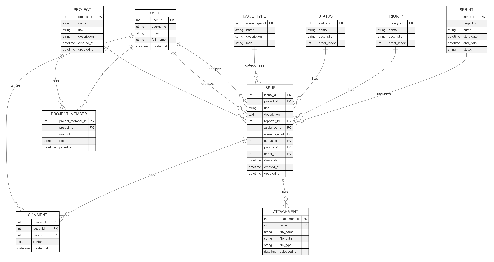
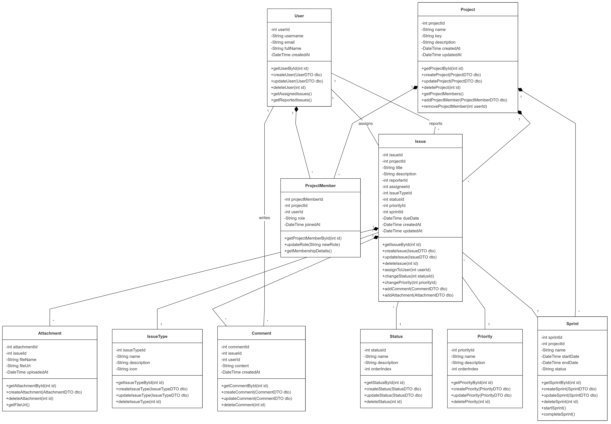

# Task2: Jira (Task Management) Design

## Problem Statement

Create ER and Class diagram with working queries optimised till 3rd NF for JIRA kind of platform.

### ER Diagram

### Class diagram

### Thought Process

- Started by thinking of issues and the project which it will be assigned to. This was the base plan

- For every issue there is must be someone whom that issue can be assigned to as well as reported by. With that project always have a team or members so created project memebers table. From this User table and project members table were created.

- Every issue will have attached Screenshots or videos which should be handled so attachment table was created

- Similarly each issue can have comments where people discuss about the problem so comments table was created.

- each issue must have Issue Type (Bug, Feature, Task), Status (To Do, In Progress, Done), Priority (High, Medium, Low) just like JIRA platform 

- As JIRA is a agile task managemnet platform that should always have knowledge about the sprint. So Sprint table was created.

### SQL Queries

For checking all the Queries navigate to [task2.sql](task2.sql)

- Constraints like NOT NULL, Foreign key, UNIQUE, etc are taken care of to prevent empty columns, ensure data integrity as well as preventing duplicates

- Timestamps were added to the tables to keep track of all the stuff people are working on

- 3NF tables structure is ensured
